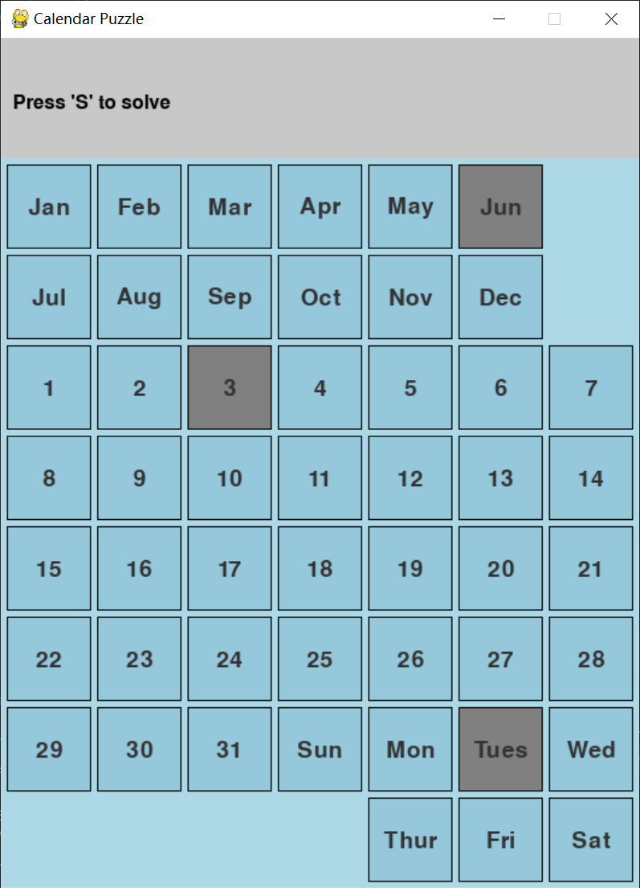
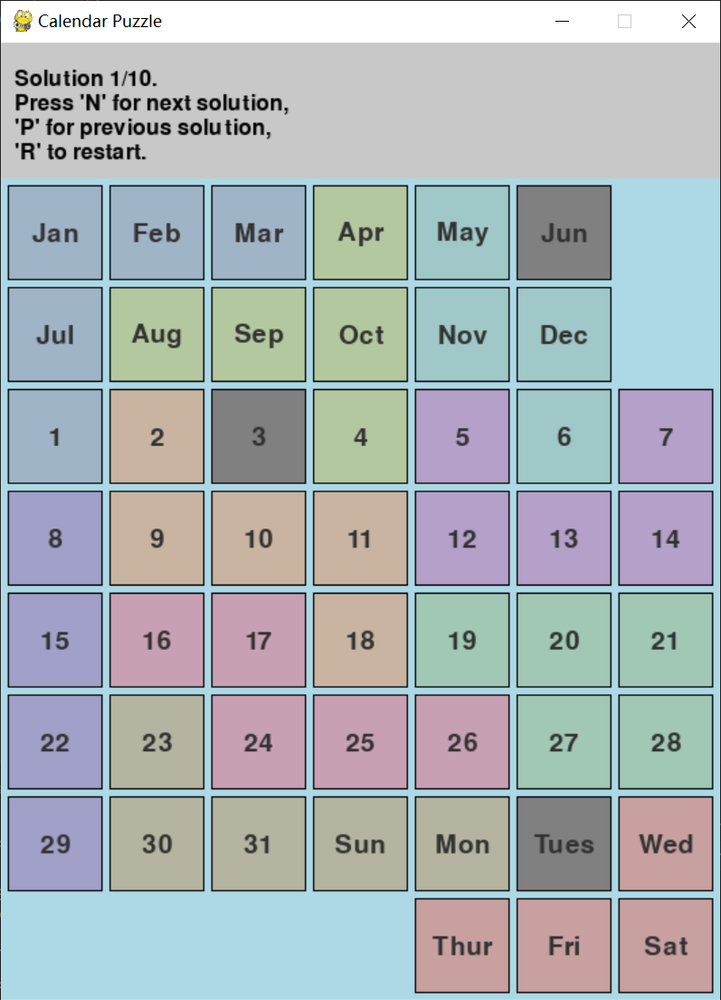

# Calendar Puzzle Solver

[English](README.md) | [中文](README_CN.md)

A calendar-themed puzzle solver built with Python and Pygame, featuring interactive gameplay and automatic solving.

## Overview

- 8×7 board layout with Month, Date, and Day-of-Week labels  
- 10 unique puzzle pieces  
- 3 target cells to remain uncovered (one each: Month, Date, Weekday)

## Features

- Interactive GUI with visual puzzle display  
- Auto-select current date, or manually pick target cells  
- Backtracking algorithm with rotation, flipping, and multi-solution support  
- Soft color scheme for better visual experience

## Requirements & Installation

### Requirements

- Python 3.x

### Install dependencies

```bash
pip install pygame
```

## How to Use

### Run the main game
```bash
python calendar_puzzle.py
```


*The main game interface showing the calendar board with month, date, and weekday labels*

### Visualize puzzle pieces
```bash
python visualize_pieces.py
```


*All available puzzle pieces displayed in the visualization tool*


### Controls

1. Selecting Target Cells: Left-click to select one Month, one Date, and one Weekday cell.

2. Game Controls:
   - 'S': Solve the puzzle (requires three target cells selected)
   - 'N': Show next solution (available after solving)
   - 'P': Show previous solution (available after solving)
   - 'R': Reset the game (only available after solving)


## Game Rules

1. The board is divided into three types of cells:
   - Months (Jan-Dec)
   - Dates (1-31)
   - Weekdays (Sun-Sat)

2. After selecting 3 target cells, the solver must:
   - Cover all other cells with puzzle pieces
   - Avoid overlaps and board boundaries
   - Respect restricted zones


## Solver Algorithm

- Backtracking with pruning
- Supports piece rotation and flipping
- Skips invalid states, preserves target cells

#### Solution Example

*A solved puzzle with pieces placed to cover all cells except the three target cells*

## Color Scheme

- Background: Light blue
- Puzzle pieces: Soft tones (blue, green, orange, purple, etc.)
- Target cells: Gray
- Restricted areas: Same as background (invisible)
- Text: Black and dark gray

## License

This project is open source and available under the MIT License.
