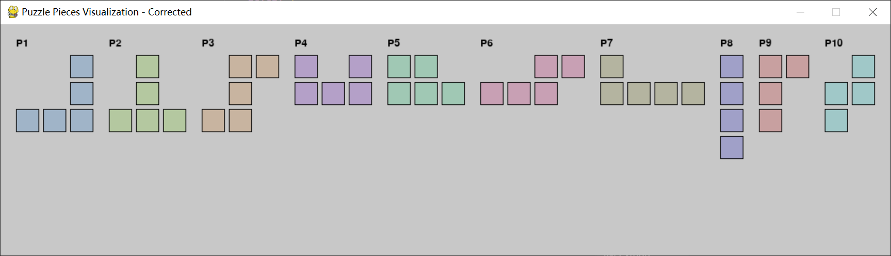

# Calendar Puzzle Solver

A Python implementation of a calendar puzzle solver using Pygame for visualization.

## Overview

This project implements a puzzle solver for a calendar-based puzzle game. The puzzle consists of:
- An 8x7 board representing a calendar layout
- 10 different puzzle pieces
- 3 target cells that must remain uncovered

## Features

- Interactive puzzle board with month, date, and weekday labels
- Automatic selection of current date cells
- Visual representation of puzzle pieces
- Solver that finds a solution using backtracking
- Support for restricted areas where pieces cannot be placed

## Requirements

- Python 3.x
- Pygame

## Installation

1. Clone the repository
2. Install the required packages:
```bash
pip install pygame
```

## Usage

### Main Game

Run the main puzzle game:
```bash
python calendar_puzzle.py
```

Controls:
- Left click: Select/unselect target cells
- 'R' key: Reset the game
- 'S' key: Solve the puzzle

### Puzzle Piece Visualization

To view all available puzzle pieces:
```bash
python visualize_pieces.py
```

### Puzzle Pieces
The puzzle includes 10 different pieces:


*All available puzzle pieces displayed in the visualization tool*

## Puzzle Rules

1. The board is divided into three types of cells:
   - Months
   - Dates
   - Weekdays

2. You must select exactly three target cells:
   - One month cell
   - One date cell
   - One weekday cell

3. The solver will then try to place all puzzle pieces on the board while:
   - Covering all cells except the three target cells
   - Not placing pieces in restricted areas
   - Not overlapping pieces

## Implementation Details

### Board Layout

The 8x7 board is organized as follows:
- Rows 1-2: Months (Jan-Dec)
- Rows 3-7: Dates (1-31)
- Rows 7-8: Weekdays (Sun-Sat)

#### Game Interface

*The main game interface showing the calendar board with month, date, and weekday labels*


### Solver Algorithm

The solver uses a backtracking algorithm with the following features:
- Tries all possible rotations and flips of each piece
- Maintains restricted areas
- Prunes invalid states early
- Preserves target cells

#### Solution Example

*A solved puzzle with pieces placed to cover all cells except the three target cells*

## License

This project is open source and available under the MIT License.
