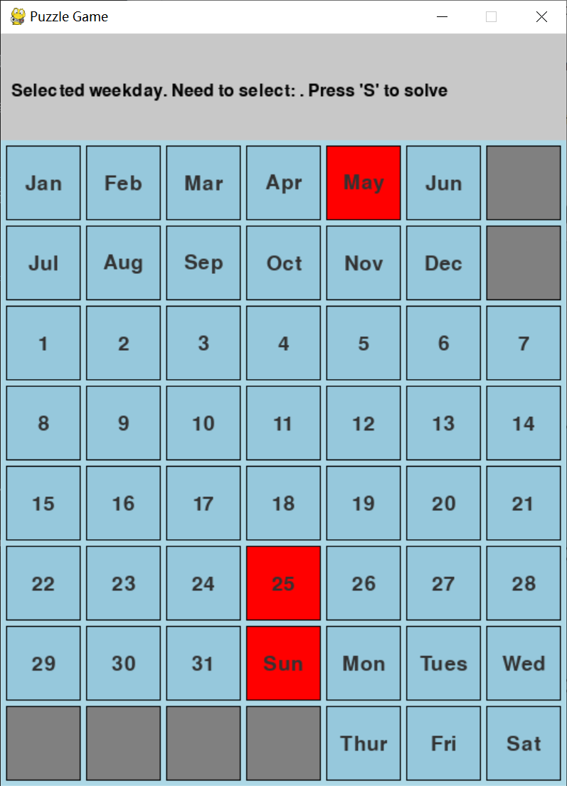
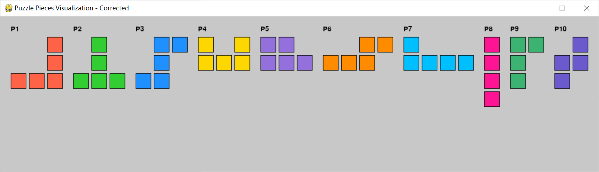
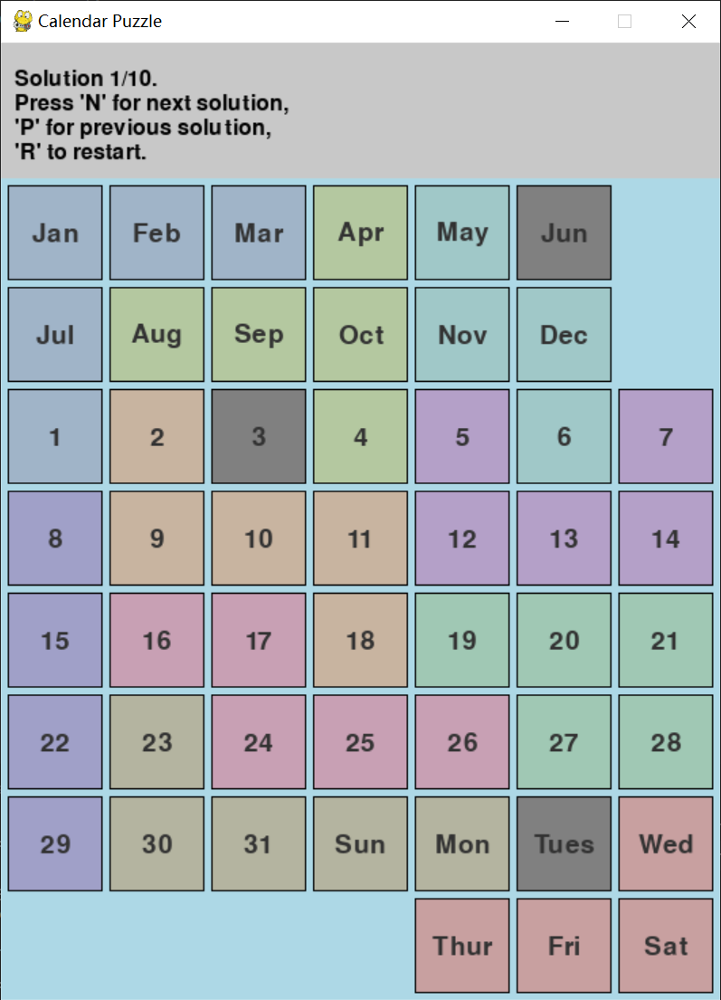

# 日历拼图求解器

[English](README.md) | [中文](README_CN.md)

基于 Pygame 的日历拼图求解器，支持交互操作与自动解谜。

## 项目简介

- 8×7 棋盘：包含月份、日期、星期
- 10 个拼图块
- 需保留 3 个目标单元格（月份 + 日期 + 星期）

## 功能特色

- 交互式图形界面，直观显示拼图块
- 自动识别当前日期，可手动选择目标单元格
- 回溯算法求解，支持旋转、翻转与多解
- 清晰配色，提升体验

## 安装与运行

### 系统要求

- Python 3.x

### 安装依赖

  ```bash
  pip install pygame
  ```

## 使用方法

### 运行主程序：
```bash
python calendar_puzzle.py
```


*显示日历棋盘的主游戏界面，包含月份、日期和星期标签*


### 查看拼图块：
```bash
python visualize_pieces.py
```


*可视化工具中显示的所有可用拼图块*


### 操作说明

1. 左键点击：选择目标单元格（各选一个 月份、日期、星期）

2. 游戏控制：
   - 'S' 键：开始求解（需要选择三个目标单元格）
   - 'N' 键：显示下一个解决方案（在找到解决方案后可用）
   - 'P' 键：显示上一个解决方案（在找到解决方案后可用）
   - 'R' 键：重置游戏（仅在已解决状态下可用）


## 游戏规则

1. 棋盘格分为三类：
   - 月份（1-12月）
   - 日期（1-31日）
   - 星期（日-六）


2. 必须选中三个目标格，其余单元格必须被拼图块完整覆盖，且：
   - 不重叠
   - 不越界
   - 不覆盖限制区域


## 算法概览

1. 回溯求解 + 剪枝优化

2. 支持拼图块的旋转与翻转

3. 自动跳过无效状态，保留目标格


### 求解示例

*一个已解决的拼图，拼图块覆盖了除三个目标单元格外的所有单元格*

## 颜色方案

- 背景：浅蓝色
- 拼图块：柔和的色调（蓝色、绿色、橙色、紫色等）
- 目标单元格：灰色
- 限制区域：与背景色相同（隐藏）
- 文本：黑色和深灰色

## 许可证

本项目是开源的，使用 MIT 许可证。 